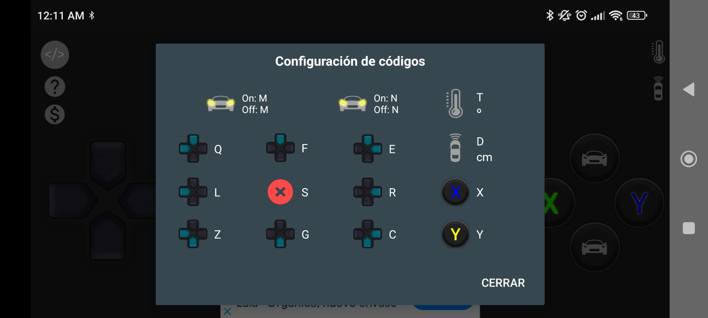

# carrito

## Circuito TB6612FNG

### Puente h  pinout

### Arduino

## Circuito L298N

### Puente h  pinout

### Arduino

## App

[Play Store link](https://play.google.com/store/apps/details?id=com.electro_tex.bluetoothcar)

Comandos enviados a arduino por BT Serial

## Lista de Materiales

- [Punete h Tb6612fng](https://articulo.mercadolibre.com.mx/MLM-624392412-modulo-puente-h-tb6612fng-12a-_JM?quantity=3)

- [Arduino nano](https://articulo.mercadolibre.com.mx/MLM-894290750-nano-placa-compatible-con-arduino-cable-usb-_JM?quantity=5)

- [Chasis carro](https://articulo.mercadolibre.com.mx/MLM-914687678-chasis-de-carro-kit-arduino-2-llantas-_JM#reco_item_pos=0&reco_backend=recomm-platform_v2p_univb&reco_backend_type=low_level&reco_client=vip-v2p&reco_id=6a485ce7-98b7-4fff-bffa-b2523ab6ebeb)

- [Bluetooth HC-05](https://articulo.mercadolibre.com.mx/MLM-812004818-5-piezas-modulo-bluetooth-hc-05-maestroesclavo-arduino-pic-_JM?quantity=1)

- [Mini Protoboards](https://articulo.mercadolibre.com.mx/MLM-810588071-10-piezas-mini-protoboard-170-puntos-proto-arduino-_JM?quantity=1)

- [Jumpers](https://articulo.mercadolibre.com.mx/MLM-810499552-120-cables-jumpers-dupont-h-h-m-m-h-m-10cm-para-protoboard-_JM?quantity=1&variation_id=83755075322)

- [ESP32 - opcional](https://articulo.mercadolibre.com.mx/MLM-823146845-esp32-wifi-bluetooth-42-ble-nodemcu-_JM?quantity=1)

